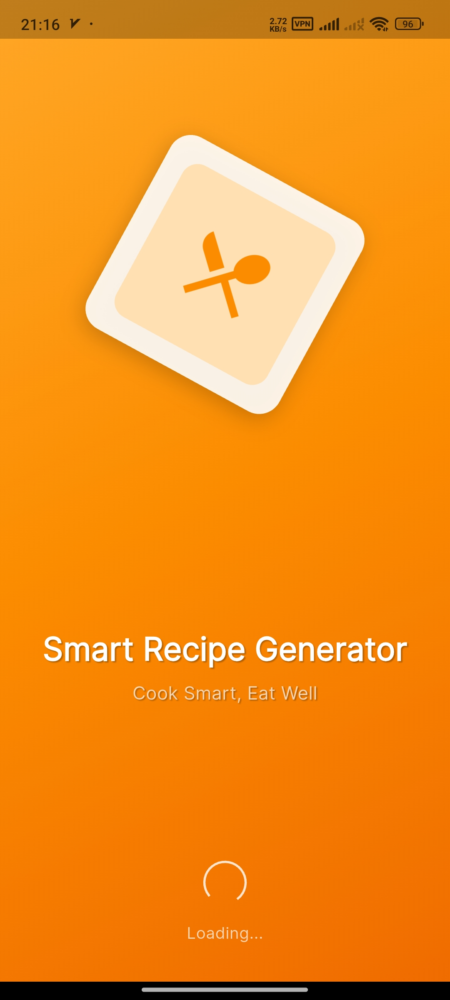
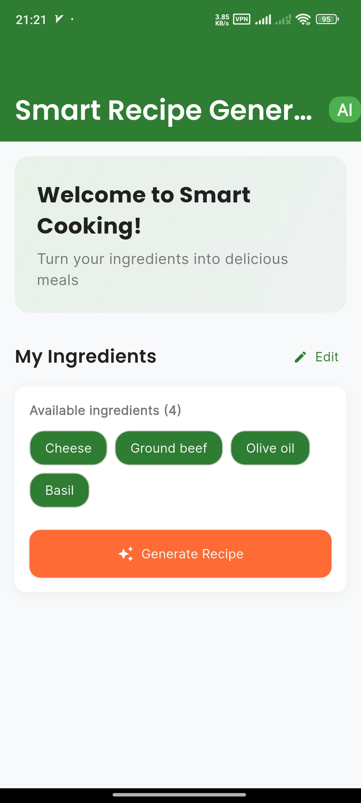
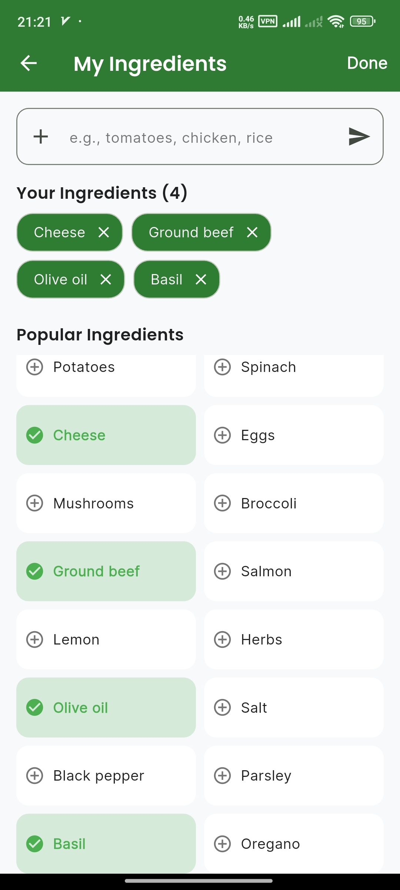
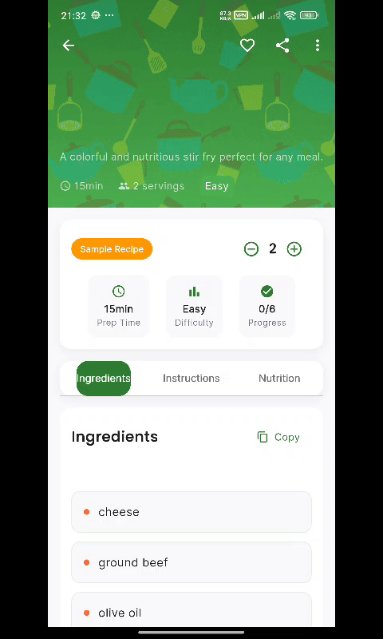

🍳 Smart Recipe Generator
=========================

[](https://github.com/abbasiandev/smart_recipe_generator/actions) [](https://flutter.dev/) [](https://dart.dev/) [](https://bloclibrary.dev/) [](https://developer.apple.com/ios/) [](https://developer.android.com/)

Perfect for discovering new meals with what you have at home! Never waste ingredients again and explore creative cooking possibilities powered by AI.

📸 Screenshots
--------------

<table align="center">
  <tr>
    <td align="center">
      
    </td>
    <td align="center">
      
    </td>
    <td align="center">
      
    </td>
    <td align="center">
      
    </td>
  </tr>
</table>

✨ Features
----------

### 🥗 Core Features

-   **Ingredient Management**: Add, edit, and organize your available ingredients with categories
-   **AI Recipe Generation**: Get creative, personalized recipes using OpenAI's GPT-4
-   **Smart Suggestions**: Intelligent ingredient recommendations based on your preferences
-   **Recipe History**: Keep track of previously generated recipes you loved

### 🎨 User Experience

-   **Beautiful UI**: Modern Material Design 3 interface with smooth animations
-   **Dark/Light Mode**: Automatic theme switching based on system preferences
-   **Intuitive Navigation**: Easy-to-use bottom navigation and gesture controls
-   **Responsive Design**: Optimized for both phones and tablets

### 🔧 Technical Features

-   **Offline Support**: Fallback sample recipes when AI is unavailable
-   **Recipe Sharing**: Copy and share recipes with friends and family
-   **Local Storage**: Save favorite recipes and ingredients locally
-   **Performance Optimized**: Fast loading and smooth scrolling experience

🏗️ Architecture
----------------

This app follows Clean Architecture principles with the following layers:

### 📱 Presentation Layer

-   **UI Components**: Reusable Flutter widgets with Material Design 3
-   **State Management**: BLoC pattern for predictable state management

#### 🧩 Why BLoC Pattern?

**BLoC (Business Logic Component)** is a reactive state management pattern that separates business logic from UI components. Here's why we chose BLoC for this project:

**What is BLoC?**

-   **B**usiness **Lo**gic **C**omponent is a design pattern that helps separate presentation from business logic
-   Uses **Streams** and **Sinks** to handle data flow reactively
-   Follows the **Single Responsibility Principle** - each BLoC handles one specific feature
-   Implements **Event-Driven Architecture** where UI sends events and BLoC responds with states

**Key Benefits:**

✅ **Predictable State Management**: Every state change is traceable and testable  
✅ **Separation of Concerns**: UI components only handle presentation, business logic stays in BLoC  
✅ **Reactive Programming**: Automatic UI updates when data changes  
✅ **Testability**: Easy to unit test business logic without UI dependencies  
✅ **Scalability**: Clear structure that grows well with app complexity  
✅ **Reusability**: BLoCs can be shared across multiple UI components

-   **BLoC Flow in Our App:**

```
┌─────────────┐    Events    ┌──────────────┐    States    ┌─────────────┐
│     UI      │─────────────▶│     BLoC     │─────────────▶│     UI      │
│  (Widgets)  │              │ (Business    │              │  (Rebuild)  │
│             │              │   Logic)     │              │             │
└─────────────┘              └──────────────┘              └─────────────┘
                                     │
                                     ▼
                              ┌──────────────┐
                              │ Repositories │
                              │   (Data)     │
                              └──────────────┘
```

**BLoC vs Other State Management Solutions:**

| Feature | BLoC | Provider | Riverpod | GetX |
| --- | --- | --- | --- | --- |
| **Learning Curve** | Medium | Easy | Medium | Easy |
| **Boilerplate** | Medium | Low | Low | Very Low |
| **Testability** | Excellent | Good | Excellent | Good |
| **Scalability** | Excellent | Good | Excellent | Medium |
| **Performance** | Excellent | Good | Excellent | Good |
| **Community** | Large | Large | Growing | Medium |

**Why BLoC for Recipe Generation?**

1.  **Complex State Management**: Recipe generation involves multiple states (loading, success, error, caching)
2.  **Reactive UI**: Ingredients list changes should automatically update recipe suggestions
3.  **Business Logic Separation**: AI integration and data processing logic stays separate from UI
4.  **Testing Requirements**: Critical business logic needs thorough testing
5.  **Future Scalability**: Easy to add features like recipe history, favorites, and user preferences

### 🧠 Domain Layer

-   **Use Cases**: Business logic for recipe generation, ingredient management
-   **Entities**: Core data models (Recipe, Ingredient, User preferences)
-   **Repositories**: Abstract interfaces for data access

### 💾 Data Layer

-   **Remote Data Source**: OpenAI API integration for recipe generation
-   **Local Data Source**: Hive database for offline storage
-   **Network Layer**: Dio for HTTP requests with retry mechanisms

🚀 Getting Started
------------------

### Prerequisites

-   Flutter 3.16.0 or higher
-   Dart 3.2.0 or higher
-   OpenAI API key (optional - app works with sample recipes without it)
-   Android Studio / VS Code with Flutter extensions

### Installation

1.  **Clone the repository**

    bash

    ```
    git clone https://github.com/abbasiandev/smart_recipe_generator.git
    cd smart_recipe_generator
    ```

2.  **Install dependencies**

    bash

    ```
    flutter pub get
    ```

3.  **Set up OpenAI API (Optional)**
    -   Create a `.env` file in the root directory
    -   Add your OpenAI API key:

        ```
        OPENAI_API_KEY=your_api_key_here
        ```

4.  **Run the app**

    bash

    ```
    flutter run
    ```
